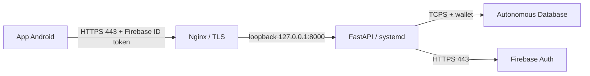

# Plano de Deploy - OCI Ubuntu 26.04

## Objetivo

Preparar a VM Compute Ubuntu 26.04 limpa para servir a Wealthy API em producao, conectando ao Oracle Autonomous Database existente por wallet, validando Firebase ID tokens e publicando somente HTTPS. Este documento e um roteiro; nenhum recurso da VM sera alterado ate a execucao das etapas.

## Arquitetura prevista



Uvicorn fica ligado apenas em loopback. A VM nao abre a porta 8000 nem portas do banco para a Internet.

## Decisoes e pre-requisitos

Antes de executar, confirmar:

- Dominio para a API e DNS `A` apontando para um IP publico reservado da VM.
- ADB usa endpoint publico com ACL ou endpoint privado na VCN. Para ACL publica, autorizar o IP de saida estavel da VM/NAT.
- A subnet, route table, NSG/security list permitem a VM alcancar o host e a porta TCPS encontrados no `tnsnames.ora` da wallet. Em wallets ADB, a porta costuma ser 1522; conferir o descriptor real, nao presumir.
- Usuario Oracle de aplicacao tem quota nos tablespaces necessarios e privilegios limitados ao schema Wealthy.
- UID Firebase que pode acessar a API e UID(s) admin para importacao. Service account Firebase fica em arquivo protegido fora do checkout.
- Decidir como proteger `/docs` e `/openapi.json` em producao. Os endpoints de negocio exigem Firebase, mas a documentacao Swagger e publica por padrao; restringi-la por VPN/IP ou desativar em producao se nao for necessaria.
- Oracle e o unico backend do codigo e dos testes. Configure os valores `WEALTHY_ORACLE_*` no arquivo de ambiente do servico; nao ha seletor de backend nem armazenamento local alternativo.

## Fase 1 - Rede e acesso a VM

1. Associar um IP publico reservado e apontar o DNS do dominio para ele.
2. Na NSG/security list da OCI, permitir entrada TCP 22 somente do IP/CIDR administrativo; TCP 80 para ACME/redirect e TCP 443 para HTTPS. Nao criar regra publica para TCP 8000, 1521 ou 1522.
3. Configurar egress DNS e HTTPS 443 para atualizacoes, Google/Firebase e validacao de certificados; liberar TCPS somente para o host/porta do ADB. Se o ADB usar endpoint privado, confirmar VCN, rotas e NSG em vez de abrir ACL publica.
4. Confirmar acesso SSH por chave antes de endurecer sshd; manter acesso pelo console serial/OCI como recuperacao.

## Fase 2 - Ubuntu e usuario de servico

Atualizar o sistema e instalar apenas os componentes necessarios:

```bash
sudo apt update
sudo apt full-upgrade -y
sudo apt install -y python3 python3-venv python3-pip git ca-certificates nginx certbot python3-certbot-nginx
python3 --version
```

A versao Python deve satisfazer `>=3.12,<3.15`, conforme `pyproject.toml`. Usar o Python da distribuicao que satisfaz esse intervalo; nao substituir o Python do sistema por instalacao manual.

Criar usuario sem login interativo e diretorios protegidos:

```bash
sudo useradd --system --home /opt/wealthy-api --shell /usr/sbin/nologin wealthy-api
sudo install -d -o root -g wealthy-api -m 0750 /opt/wealthy-api/app
sudo install -d -o root -g wealthy-api -m 0750 /etc/wealthy-api
sudo install -d -o wealthy-api -g wealthy-api -m 0700 /etc/wealthy-api/oracle-wallet
sudo install -d -o wealthy-api -g wealthy-api -m 0700 /etc/wealthy-api/firebase
```

Ativar UFW sem perder SSH: permitir primeiro OpenSSH, HTTP e HTTPS; depois aplicar politica de entrada deny e saida allow. Replicar regras tambem na NSG da OCI.

## Fase 3 - Codigo e ambiente Python

1. Obter o codigo em `/opt/wealthy-api/app` por deploy key somente leitura ou pipeline; nunca colocar chave de deploy no repositorio.
2. Criar venv e instalar dependencias de runtime:

```bash
cd /opt/wealthy-api/app
sudo -u wealthy-api python3 -m venv .venv
sudo -u wealthy-api .venv/bin/python -m pip install --upgrade pip
sudo -u wealthy-api .venv/bin/python -m pip install .
```

3. Manter releases versionadas para permitir rollback do codigo sem reverter schema automaticamente.

## Fase 4 - Wallet e configuracao secreta

Extrair a wallet para `/etc/wealthy-api/oracle-wallet`; verificar que contem `tnsnames.ora` e `ewallet.pem`. Restringir leitura ao usuario/grupo do servico. Colocar o JSON de service account Firebase em `/etc/wealthy-api/firebase/` com permissao `0640` e acesso somente ao servico.

Criar `/etc/wealthy-api/api.env` como `root:wealthy-api`, modo `0640`. Nao copiar `.env` de desenvolvimento nem incluir valores secretos no Git. Definir as chaves:

```ini
WEALTHY_ORACLE_USER=<schema_de_aplicacao>
WEALTHY_ORACLE_PASSWORD=<segredo_do_schema>
WEALTHY_ORACLE_DSN=e7h50o2uobc0nl1q_medium
WEALTHY_ORACLE_WALLET_LOCATION=/etc/wealthy-api/oracle-wallet
WEALTHY_ORACLE_WALLET_PASSWORD=<senha_da_wallet>
WEALTHY_FIREBASE_PROJECT_ID=<project_id_firebase>
WEALTHY_FIREBASE_CREDENTIALS_FILE=/etc/wealthy-api/firebase/service-account.json
WEALTHY_FIREBASE_ALLOWED_UIDS=<uid(s)_autorizado(s)_separados_por_virgula>
WEALTHY_FIREBASE_ADMIN_UIDS=<uid(s)_admin_separados_por_virgula>
WEALTHY_IMPORT_MAX_BYTES=104857600
WEALTHY_SQL_ECHO=false
```

O `EnvironmentFile` do systemd fornece essas variaveis ao processo; elas prevalecem sobre os arquivos dotenv. O arquivo de service account, wallet, senhas e UID nao devem ser impressos em logs nem enviados ao chat.

## Fase 5 - Migration Oracle

Criar uma unidade systemd `wealthy-api-migrate.service` do tipo `oneshot`, com `User=wealthy-api`, `WorkingDirectory=/opt/wealthy-api/app` e `EnvironmentFile=/etc/wealthy-api/api.env`. O comando de execucao sera:

```text
/opt/wealthy-api/app/.venv/bin/alembic upgrade head
```

Executar a migration antes de iniciar/atualizar a API e validar:

```bash
sudo systemctl start wealthy-api-migrate.service
sudo -u wealthy-api /opt/wealthy-api/app/.venv/bin/alembic current
sudo -u wealthy-api /opt/wealthy-api/app/.venv/bin/alembic check
```

Se a migration falhar, parar e inspecionar o estado Oracle antes de repetir: DDL Oracle pode fazer commit implicito. Nao executar `downgrade` automaticamente em producao.

## Fase 6 - Uvicorn com systemd

Criar `/etc/systemd/system/wealthy-api.service` com estes campos essenciais:

```ini
[Unit]
Description=Wealthy API
After=network-online.target
Wants=network-online.target

[Service]
Type=simple
User=wealthy-api
Group=wealthy-api
WorkingDirectory=/opt/wealthy-api/app
EnvironmentFile=/etc/wealthy-api/api.env
ExecStart=/opt/wealthy-api/app/.venv/bin/uvicorn wealthy_api.main:app --host 127.0.0.1 --port 8000 --workers 1
Restart=on-failure
RestartSec=5
NoNewPrivileges=true
PrivateTmp=true
ProtectSystem=strict
ProtectHome=true

[Install]
WantedBy=multi-user.target
```

Em seguida:

```bash
sudo systemctl daemon-reload
sudo systemctl enable --now wealthy-api
sudo systemctl status wealthy-api
sudo journalctl -u wealthy-api -n 100 --no-pager
```

Usar um worker inicialmente, dado o baixo volume e o tamanho pequeno do pool. Nao usar `--reload` em producao.

## Fase 7 - Nginx e HTTPS

Criar um `server` Nginx para o dominio com `proxy_pass http://127.0.0.1:8000`, encaminhar `Host`, `X-Forwarded-For` e `X-Forwarded-Proto`, e definir `client_max_body_size` ligeiramente acima de `WEALTHY_IMPORT_MAX_BYTES` (por exemplo, 110m para limite de arquivo 100 MiB). Validar a configuracao e obter certificado:

```bash
sudo nginx -t
sudo systemctl reload nginx
sudo certbot --nginx -d api.seu-dominio
```

Redirecionar HTTP para HTTPS. Nunca publicar Uvicorn diretamente. Se Swagger precisar permanecer acessivel, restringir `/docs` e `/openapi.json` por IP/VPN ou proteger com mecanismo apropriado.

## Fase 8 - Validacao

- `systemctl is-active wealthy-api` e `/health` devem responder OK.
- `/docs` e `/openapi.json` devem refletir o release esperado.
- Sem bearer token, endpoints de negocio retornam `401`; token invalido retorna `401`; UID fora das listas retorna `403`.
- Com ID token Firebase real de UID permitido, consultar imoveis e criar/consultar um registro de teste aprovado.
- UID comum nao pode chamar `POST /api/v1/admin/imoveis/importacoes`; UID admin pode enviar CSV pequeno e obter resumo/logs.
- Validar acesso a `SELECT 1 FROM DUAL`, `alembic current`, `alembic check`, renovacao automatica do certificado e logs via journald.
- Confirmar que acesso SSH e o endpoint ADB nao estao expostos alem do necessario e que arquivos de segredo nao estao no checkout.

## Atualizacao e rollback

Publicar novo release, instalar dependencias, executar migration como etapa separada, trocar symlink/current e reiniciar `wealthy-api`. Fazer backup/restore de dados pelo Autonomous Database e usar retencao ja configurada no ADB. Reverter codigo nao implica downgrade de schema; migrations devem ser reversiveis quando seguro, mas downgrade de producao requer avaliacao explicita.

## Gates para go-live

- Dominio, IP reservado, NSG e rota/ACL Oracle validados.
- Usuario Oracle de minimo privilegio com quota confirmada.
- Wallet e credenciais Firebase em caminhos protegidos fora do repositorio.
- Credenciais e wallet Oracle configuradas no systemd; Oracle e o unico backend suportado.
- HTTPS ativo; API de negocio autenticada; allowlists testadas; processo systemd estavel; migrations sem drift; backup/restauracao revistos.
